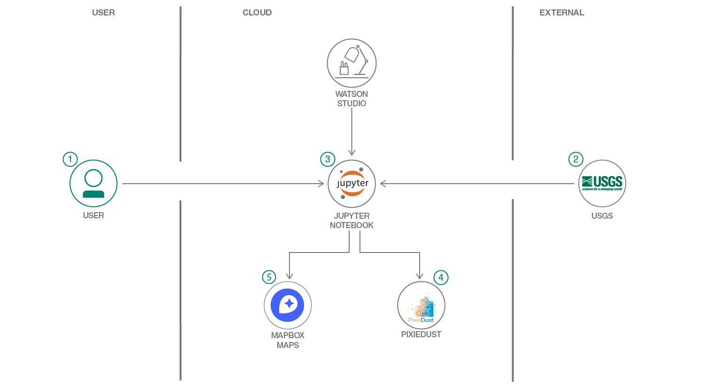
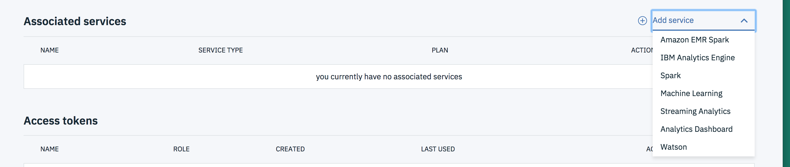
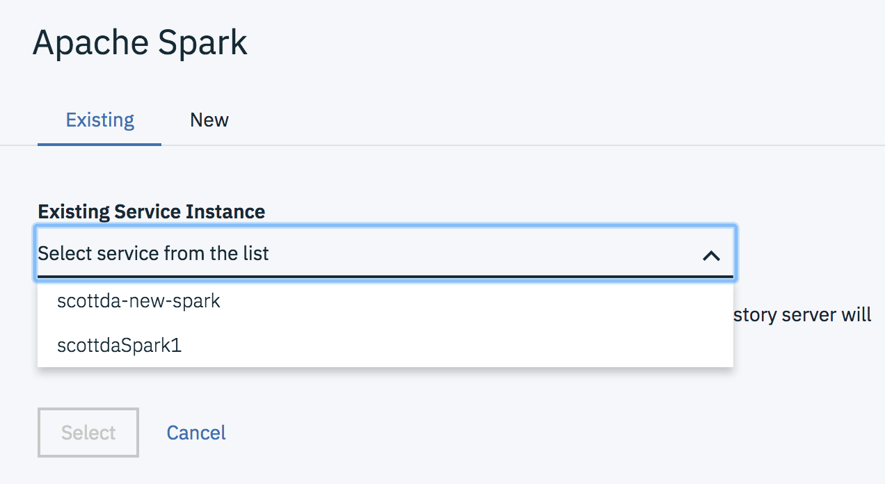
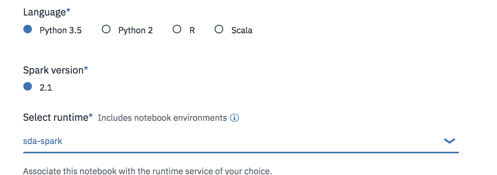

*他の言語で読む: [English](README.md).*

# Jupyter Notebook、PixieDust、PixieApps を使用してサンフランシスコの交通情報を視覚化し分析する

> Data Science Experience は現在 Watson Studio です。このコードパターンの一部の画像では、サービスが Data Science Experience として表示されることがありますが、手順とプロセスは引き続き機能します。

このコードパターンでは、IBM Watson Studio 上で実行されている PixieDust を使用して、サンフランシスコ市からの交通鎮静化 (車の速度制限など) や事故データを分析します。Watson Studio は、データ科学者、開発者、およびデータサイエンスに興味のある方々がツール (例: RStudio、Jupyter Notebooks、Spark など) を使用して、データに関する共同作業を行い、共有し、洞察を収集する、インタラクティブで協力的なクラウドベースの環境です。

このコードパターンを通じてと、以下のことを理解できるでしょう:

* [Jupyter Notebooks](http://jupyter.org/) を使用してデータをロード、視覚化、分析する
* [IBM Watson Studio](https://dataplatform.ibm.com/) 内で Jupyter Notebook を実行する
* [PixieDust](https://github.com/ibm-cds-labs/pixiedust) を IPython Notebook ヘルパーとして使用する
* [PixieApps](https://ibm-watson-data-lab.github.io/pixiedust/pixieapps.html) を使用してダッシュボードを作成する
* サンフランシスコ市の [DataSF Open Data](https://datasf.org/opendata/) からデータをフェッチする
* [Mapbox GL](https://www.mapbox.com/mapbox-gl-js/api/) を使用してインタラクティブな地図を作成する

このコードパターンの対象読者は、アプリケーション開発者、およびデータサイエンスのパワーを迅速かつ効果的に利用したいと考える方々です。



# Flow

1. 用意されているノートブックを IBM Watson Studio プラットフォームにロードします。
2. [DataSF Open Data](https://datasf.org/opendata/) が公開している交通情報を Jupyter Notebook にロードします。
3. ノートブックによって交通情報が分析されます。
4. チャートやグラフは、インタラクティブに変更することができます。
5. PixieApp ダッシュボードが作成されて、やり取りできるようになります。


# 含まれるコンポーネント

* [IBM Watson Studio](https://www.ibm.com/blogs/solutions/jp-ja/watson-studio/): ビジネス課題をチームメンバーと協働しながら、データを活用して解決するための環境とツールを提供します。ビジネスへのAI活用のために必要な機能がオールインワンとなっている統合開発・分析環境と言えます。

## 利用した技術

* [Jupyter ノートブック](http://jupyter.org/): ライブコード、方程式、視覚化、説明テキストを含むドキュメントを作成して共有できるオープンソースの Web アプリケーション。

* [PixieDust](https://github.com/ibm-cds-labs/pixiedust): Python ノートブックのための Python ヘルパーライブラリ。

* [PixieApps](https://ibm-cds-labs.github.io/pixiedust/pixieapps.html): 分析のための UI 要素を記述し、Jupyter ノートブックで直接実行できる Python ライブラリ。

* [Mapbox GL](https://www.mapbox.com/mapbox-gl-js/api/): WebGL を使用してインタラクティブな地図をレンダリングするための JavaScript ライブラリ。

# ビデオを観る

[](https://www.youtube.com/watch?v=cYUdXFEmxP4)

# 手順

このコードパターンを設定して実行するには、以下の手順に従ってください。

1. [Watson Studio にサインアップする](#1-sign-up-for-watson-studio)
2. [Spark サービスを作成する](#2-create-the-spark-service)
3. [ノートブックを作成する](#3-create-the-notebook)
4. [ノートブックを実行する](#4-run-the-notebook)
5. [結果を分析する](#5-analyze-the-results)
6. [保存し共有する](#6-save-and-share)

<a name="1-sign-up-for-watson-studio"></a>
## 1. Watson Studio にサインアップする

IBM [Watson Studio](https://dataplatform.ibm.com) にサインアップします。Watson Studio でプロジェクトを作成することで、フリーティアの ``Object Storage`` サービスが IBM Cloud アカウントに作成されます。以降の手順でサービス名を選択する必要があるので、サービス名をメモしておきます。

> ノート: Object Storage サービスを作成するときは、アップグレード料金を支払う必要がないように、`` Free`` ストレージタイプを選択してください。

<a name="2-create-the-spark-service"></a>
## 2. Spark サービスを作成する

* プロジェクトの `Settings` タブで、`Associated Services` までスクロールして `+ Add service` - > `Spark` を選択します。

  

* `Existing` で Spark サービスを選択するか、`New` で新しいサービスを作成します。

  

<a name="3-create-the-notebook"></a>
## 3. ノートブックを作成する

* [Watson Studio](https://dataplatform.ibm.com) で、`Create notebook` をクリックしてノートブックを作成します。
* 必要であればプロジェクトを作成し、その際に要求されればオブジェクトストレージサービスも準備します。
* `Assets` タブで `Create notebook` オプションを選択します。
* `From URL` タブを選択します。
* ノートブックの名前を入力します。
* (これは必須ではありませんが) ノートブックの説明を入力します。
* このノートブックの URL を入力します: https://raw.githubusercontent.com/IBM/pixiedust-traffic-analysis/master/notebooks/pixiedust-traffic-analysis.ipynb
* このプロジェクトに関連付けておいた Spark ランタイムを選択します:

  

* `Create Notebook` ボタンをクリックします:
  

<a name="4-run-the-notebook"></a>
## 4. ノートブックを実行する

ノートブックが実行される際、実際の動作としては、ノートブック内の各コード・セルが上から順に実行されています。

各コード・セルは選択可能で、左端にタグが付いています。タグのフォーマットは `In [x]：` です。ノートブックの状態に応じて、 `x` は次のようになります:

* 空白は、セルが実行されたことがないことを示します。
* 数字は、このコードステップが実行された相対的な順序を表します。
* `*` は、セルが現在実行中であることを示します。

ノートブックでコードセルを実行する方法はいくつかあります:

* 一度に1つのセルを実行
  * セルを選択し、ツールバーの `Play` ボタンを押します。
* 順番に実行するバッチモード
  * `Cell` メニューバーにはいくつかのオプションがあります。例えば、 `Run All` でノートブックの全てのセルを実行することができます。`Run All Below` では、現在選択されているセルのうち最初のセルから実行を開始し、それに続くすべてのセルを実行します。
* 予定時刻に実行する
  * ノートブックパネルの右上にある `Schedule` ボタンを押してください。 ここでは、ノートブックが将来のある時点で1回実行されるように、または指定された間隔で繰り返し実行されるように、スケジュールすることができます。

<a name="5-analyze-the-results"></a>
## 5. 結果を分析する

ノートブックの各セルを実行すると、結果が表示されます。 PixieDust ``display()`` を使ってインタラクティブなデータセットを作成すると、テーブル、グラフ、チャートを使って様々な視覚化を試すことができます。

### PixieDust チャートのオプション

セル #3 `display(accidents)` を実行した後、`Options` ボタンをクリックすると、チャートで使用されているフィールドのキーと値を操作できます:


指示に従い、DaysOfWeek と IncidntNum を使用しますが、ユーザーはキーと値を変更して、異なる入力でグラフがどのように変化するかを確認できます。

### Spark SQL を使用してデータを照会する

Spar SQLを使用して、タラヴァル地区のデータを分離します:

```
accidents.registerTempTable("accidents")
taraval = sqlContext.sql("SELECT * FROM accidents WHERE PdDistrict='TARAVAL'")
```

タラヴァル地区のインタラクティブ地図を取得します:


### ダッシュボードを作成する

PixieApps を利用すると、さまざまなデータセット (交通渋滞、警察、事故など) を視覚化するために使用できる地図レイヤーを備えたダッシュボードを作成できます。


#### 雛形 (スケルトン) の作成

```
from pixiedust.display.app import *

@PixieApp
class SFDashboard():
    def mainScreen(self):
        return """
<div class="well">
    <center><span style="font-size:x-large">Analyzing San Francisco Public Safety data with PixieDust</span></center>
    <center><span style="font-size:large"><a href="https://datasf.org/opendata" target="new">https://datasf.org/opendata</a></span></center>
</div>
<div class="row">
    <div class="form-group col-sm-2" style="padding-right:10px;">
        <div><strong>Layers</strong></div>
        
        <div class="rendererOpt checkbox checkbox-primary">
            <input type="checkbox" pd_refresh="map{{prefix}}" pd_script="self.toggleLayer({{loop.index0}})">
            <label>{{layer["name"]}}</label>
        </div>
        
    </div>
    <div class="form-group col-sm-10">
        <div id="map{{prefix}}" pd_entity pd_options="{{this.formatOptions(this.mapJSONOptions)}}"/>
    </div>
</div>
"""
```

#### 事件・事故の地図を作成する

```
<div id="map{{prefix}}" pd_entity pd_options="{{this.formatOptions(this.mapJSONOptions)}}"/>
```

``pd_entity``: どのデータセットで作業するか PixieDust に指定します。

``pd_options``: 地図の PixieDust オプションが指定されます。

#### pd_options の生成

PixieDust 視覚化のための ``pd_options`` を生成する効果的な方法は次のとおりです:

1. 新しいセルで ``display()`` を呼び出します
2. チャートのためのグラフ化のオプションを選択します
3. ``View/Cell Toobar/Edit metadata`` メニューを選択します
4. ``Edit Metadata`` ボタンをクリックし、PixieDust メタデータをコピーします

  

``pd_options`` 表記法に従うためには、PixieDust JSON メタデータを次のようなフォーマットの属性文字列に変換する必要があります: ```“key1=value1;key2=value2;…”```

これを簡単に実施するために、シンプルな Python の変換関数を使用します:
```
def formatOptions(self, options):
    return ';'.join(["{}={}".format(k,v) for (k, v) in iteritems(options)])
```

``formatOptions`` は、html 内の [JinJa2](https://ja.wikipedia.org/wiki/Jinja) 記法を使って呼び出されます:

```
pd_options = “{{this.formatOptions(this.mapJSONOptions)}}”
```

#### pd_options の初期化

> ノート: setupは、PixieApp の初期化時に自動的に呼び出される特殊なメソッドです。

```
def setup(self):
    self.mapJSONOptions = {
      	"mapboxtoken": "pk.eyJ1IjoicmFqcnNpbmdoIiwiYSI6ImNqM2s4ZDg4djAwcGYyd3BwaGxwaDV3bWoifQ.d5Rklkdu5MeGAnXu1GMNYw",
      	"chartsize": "90",
	"aggregation": "SUM",
	"rowCount": "500",
	"handlerId": "mapView",
	"rendererId": "mapbox",
	"valueFields": "IncidntNum",
	"keyFields": "X,Y",
	"basemap": "light-v9"
    }
```

#### GeoJSON カスタムレイヤーを作成する

```
from pixiedust.display.app import *
from pixiedust.apps.mapboxBase import MapboxBase

@PixieApp
class SFDashboard(MapboxBase):
    def setup(self):

    ...<snip>...

    self.setLayers([
        {
            "name": "Traffic calming",
            "url": "https://data.sfgov.org/api/geospatial/ddye-rism?method=export&format=GeoJSON",
            "type": "symbol",
            "layout": {
                "icon-image": "police-15",
                "icon-size": 1.5
            }
        },

    ...<snip>...
```

#### レイヤーからチェックボックスを作成する

```
    ...<snip>...

    
    <div class="rendererOpt checkbox checkbox-primary">
        <input type="checkbox" pd_refresh="map{{prefix}}" pd_script="self.toggleLayer({{loop.index0}})">
        <label>{{layer["name"]}}</label>
    </div>
    

    ...<snip>...
```
ユーザーはレイヤーを選択できるようになり、地図は動的にレイヤーを追加または削除します。

<a name="6-save-and-share"></a>
## 6. 保存し共有する

### 保存の方法

`File` メニューの下に、ノートブックを保存する方法がいくつかあります:

* `Save` はバージョン情報なしで、単にノートブックの現在の状態を保存するだけです。
* `Save Version` はノートブックの現在の状態を日付とタイムスタンプを含むバージョンタグで保存します。ノートブックは最大10バージョンを保存することができ、それぞれのバージョンは、`Revert To Version` メニュー項目を選択することで取得できます。

### 共有の方法

ノートブックパネルの右上にある `Share` ボタンを選択すると、ノートブックを共有できます。このアクションを実行することで、ノートブックの「読み取り専用」バージョンを表示するURLリンクが得られます。 ノートブックから共有したいものを明確に指定するオプションがいくつかあります:

* `Only text and output`: すべてのコードセルをノートブックビューから削除します。
* `All content excluding sensitive code cells`: *sensitive* (機密) タグを含むコードセルをすべて削除します。例えば、`# @hidden_cell` はあなたの dashDB 資格情報が共有されるのを防ぐために使われます。
* `All content, including code`: ノートブックをそのまま表示します。
* これら以外にも、様々な `download as` オプションがメニューにあります。

# サンプル出力

[data/examples/pixiedust-traffic-analysis.html](data/examples/pixiedust-traffic-analysis.html)
に出力用のサンプル html があり、[rawgit](https://cdn.rawgit.com/IBM/pixiedust-traffic-analysis/783542ab87a71db93e7d9b95f732697c4219cf51/data/examples/pixiedust-traffic-analysis.html) 経由のアクセスで動作を確認できます。

> ノート: ``Options`` や ``Layers`` のような対話的なマップ機能は動作しません。これらを試すには、ノートブック自体を実行する必要があります。

# リンク

* [youtube 上のデモ動画](https://www.youtube.com/watch?v=cYUdXFEmxP4)
* [PixieDust](https://github.com/ibm-cds-labs/pixiedust)
* [PixieApps](https://ibm-watson-data-lab.github.io/pixiedust/pixieapps.html)
* [City of San Francisco Open Data](https://datasf.org/opendata/)

# もっと学ぶ

* **Artificial Intelligence コードパターン**: このコードパターンを気に入りましたか？ [AI Code コードパターン](https://developer.ibm.com/jp/technologies/artificial-intelligence/) から関連パターンを参照してください。
* **Data Science コードパターン**: このコードパターンを気に入りましたか？ [Data Science コードパターン](https://developer.ibm.com/jp/technologies/data-science/) から関連パターンを参照してください。
* **AI and Data コードパターン・プレイリスト**: コードパターンに関係するビデオ全ての [プレイリスト](https://www.youtube.com/playlist?list=PLzUbsvIyrNfknNewObx5N7uGZ5FKH0Fde) です。
* **With Watson**: [With Watson プログラム](https://www.ibm.com/watson/jp-ja/with-watson/) は、自社のアプリケーションに Watson テクノロジーを有効的に組み込んでいる開発者や企業に、ブランディング、マーケティング、テクニカルに関するリソースを提供するプログラムです。
* **Watson Studio**: [IBM Watson Studio](https://www.ibm.com/blogs/solutions/jp-ja/watson-studio/) でデータサイエンスの技術を習得する


# License

[Apache 2.0](LICENSE)
