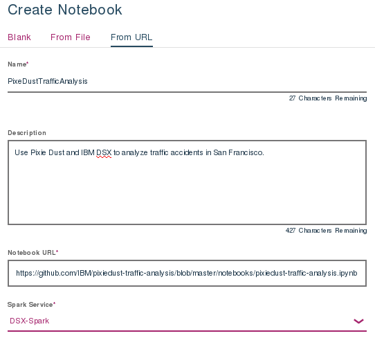
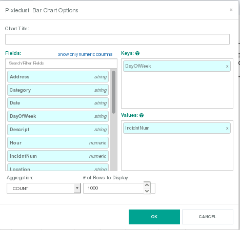
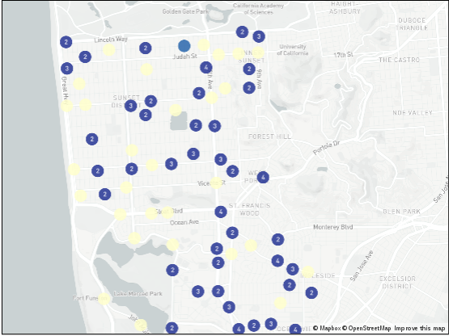
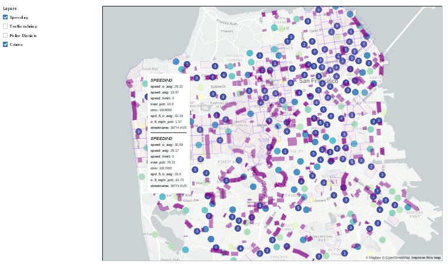
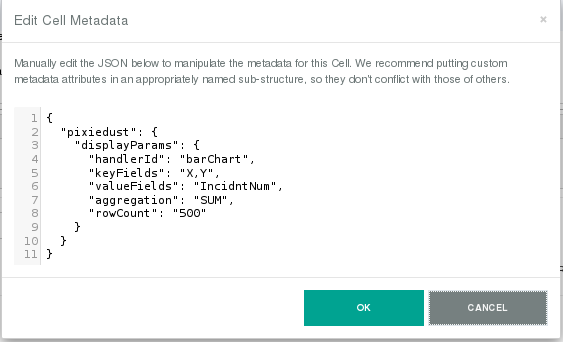

# Visualize and analyze San Francisco traffic accidents using a Jupyter Notebook, PixieDust, and PixieApps

In this developer journey we will use PixieDust running on IBM Data Science Experience (DSX) to analyze traffic data from the City of San Francisco. DSX is an interactive, collaborative, cloud-based environment where data scientists, developers, and others interested in data science can use tools (e.g., RStudio, Jupyter Notebooks, Spark, etc.) to collaborate, share, and gather insight from their data.

When the reader has completed this journey, they will understand how to:

* Use [Jupyter Notebooks](http://jupyter.org/) to load, visualize, and analyze data
* Run Notebooks in [IBM Data Science Experience](https://datascience.ibm.com/)
* Leverage [PixieDust](https://github.com/ibm-cds-labs/pixiedust) as a python notebook helper
* Build a dashboard using [PixieApps](https://ibm-cds-labs.github.io/pixiedust/pixieapps.html)
* Fetch data from [City of San Francisco Open Data](https://datasf.org/opendata/)
* Create an interactive map with [Mapbox GL](https://www.mapbox.com/mapbox-gl-js/api/)

The intended audience for this journey is application developers and other stakeholders who wish to utilize the power of Data Science quickly and effectively.


# Included Components

* [IBM Data Science Experience](https://www.ibm.com/bs-en/marketplace/data-science-experience): Analyze data using RStudio, Jupyter, and Python in a configured, collaborative environment that includes IBM value-adds, such as managed Spark.

## Featured technologies

* [Jupyter Notebooks](http://jupyter.org/): An open-source web application that allows you to create and share documents that contain live code, equations, visualizations and explanatory text.

* [PixieDust](https://github.com/ibm-cds-labs/pixiedust) Python helper library for python notebooks

* [PixieApps](https://ibm-cds-labs.github.io/pixiedust/pixieapps.html): Python library used to write UI elements for analytics, and run them directly in a Jupyter notebook.

* [Mapbox GL](https://www.mapbox.com/mapbox-gl-js/api/): JavaScript library that uses WebGL to render interactive maps.

# Watch the Video

[](https://www.youtube.com/watch?v=cYUdXFEmxP4)

# Steps

Follow these steps to setup and run this developer journey. The steps are
described in detail below.

1. [Sign up for the Data Science Experience](#1-sign-up-for-the-data-science-experience)
2. [Create the notebook](#2-create-the-notebook)
3. [Run the notebook](#3-run-the-notebook)
4. [Analyze the results](#4-analyze-the-results)
5. [Save and Share](#5-save-and-share)

## 1. Sign up for the Data Science Experience

Sign up for IBM's [Data Science Experience](http://datascience.ibm.com/). By signing up for the Data Science Experience, two services: ``DSX-Spark`` and ``DSX-ObjectStore`` will be created in your Bluemix account.

## 2. Create the notebook

Create the Project:
* From the [IBM Data Science Experience page](https://apsportal.ibm.com/analytics) either click the ``Get Started`` tab at the top or scroll down to ``Recently updated projects``.
* Click on ``+ Create Project`` or ``+ New Project`` under Recently updated projects.
* Choose a ``Name`` and, optionally, a ``Description``. Accept the default ``DSX-Spark`` for Spark Service, ``Object Storage (Swift API)`` for Storage Type, and ``DSX-ObjectStorage`` for Target Object Storage Instance.
* Click ``Create``.

Create the Notebook:
* In you project, click ``add notebooks``.
* Click the tab for ``From URL`` and enter a ``Name`` and optional ``Description``.
* In the ``Notebook URL`` box put: https://github.com/IBM/pixiedust-traffic-analysis/blob/master/notebooks/pixiedust-traffic-analysis.ipynb
* Accept the default ``DSX-Spark`` for Spark Service and click ``Create Notebook``.



## 3. Run the notebook

When a notebook is executed, what is actually happening is that each code cell in
the notebook is executed, in order, from top to bottom.

Each code cell is selectable and is preceded by a tag in the left margin. The tag
format is `In [x]:`. Depending on the state of the notebook, the `x` can be:

* A blank, this indicates that the cell has never been executed.
* A number, this number represents the relative order this code step was executed.
* A `*`, this indicates that the cell is currently executing.

There are several ways to execute the code cells in your notebook:

* One cell at a time.
  * Select the cell, and then press the `Play` button in the toolbar.
* Batch mode, in sequential order.
  * From the `Cell` menu bar, there are several options available. For example, you
    can `Run All` cells in your notebook, or you can `Run All Below`, that will
    start executing from the first cell under the currently selected cell, and then
    continue executing all cells that follow.
* At a scheduled time.
  * Press the `Schedule` button located in the top right section of your notebook
    panel. Here you can schedule your notebook to be executed once at some future
    time, or repeatedly at your specified interval.

## 4. Analyze the Results

After running each cell of the notebook, the results will display. When we use PixieDust ``display()`` to create an interactive dataset, we are able to change the visualization using tables, graphs, and charts.

### Options for PixieDust Charts

After running cell #3 `display(accidents)`, we can see by clicking the `Options` button that we are able to manipulate the keys and values for the fields used in the chart:



Following the instructions, we use DaysOfWeek and IncidntNum, but the user can change the keys and value to see how the chart will look with different inputs.

### Use Spark SQL to query data

We use Spark SQL to isolate data to the Taraval district:

```
accidents.registerTempTable("accidents")
taraval = sqlContext.sql("SELECT * FROM accidents WHERE PdDistrict='TARAVAL'")
```

We then get an interactive map of the Taraval district:



### Create a PixieApp Dashboard

With PixieApps, we can create a dashboard with map layers that can be used to visualize various datasets (i.e. Speeding, Traffic Calming, Police Districts, and Crimes):



#### Create the skeleton

```
from pixiedust.display.app import *

@PixieApp
class SFDashboard():
    def mainScreen(self):
        return """
<div class="well">
    <center><span style="font-size:x-large">Analyzing San Francisco Public Safety data with PixieDust</span></center>
    <center><span style="font-size:large"><a href="https://datasf.org/opendata" target="new">https://datasf.org/opendata</a></span></center>
</div>
<div class="row">
    <div class="form-group col-sm-2" style="padding-right:10px;">
        <div><strong>Layers</strong></div>
        
        <div class="rendererOpt checkbox checkbox-primary">
            <input type="checkbox" pd_refresh="map{{prefix}}" pd_script="self.toggleLayer({{loop.index0}})">
            <label>{{layer["name"]}}</label>
        </div>      
        
    </div>
    <div class="form-group col-sm-10">
        <div id="map{{prefix}}" pd_entity pd_options="{{this.formatOptions(this.mapJSONOptions)}}"/>
    </div>
</div>
"""
```

#### Create the Map of Accidents

```
<div id="map{{prefix}}" pd_entity pd_options="{{this.formatOptions(this.mapJSONOptions)}}"/>
```

``pd_entity``: Tell PixieDust which dataset to work on.
 
``pd_options``: Contains the PixieDust options for the map.

#### Generate the pd_options

The best way to generate the pd_options for a PixieDust visualization is to: 
1.  Call ``display()`` on a new cell 
2.  Graphically select the options for your chart 
3.  Select ``View/Cell Toobar/Edit metadata`` menu 
4.  Click on the ``Edit Metadata`` button and copy the PixieDust metadata  



To conform to the pd_options notation, we need to transform the PixieDust JSON metadata into an attribute string with the following format: ```“key1=value1;key2=value2;…”```

To make it easier, we use the a simple Python transform function: 
```
def formatOptions(self, options):
    return ';'.join(["{}={}".format(k,v) for (k, v) in iteritems(options)])
```

The ``formatOptions`` is then invoked using JinJa2 notation from within the html:

```
pd_options = “{{this.formatOptions(this.mapJSONOptions)}}” 
```

#### Initialize the pd_options

> Note: setup is a special method that will be called automatically when the PixieApp is initialized.

```
def setup(self):
    self.mapJSONOptions = {
      	"mapboxtoken": "pk.eyJ1IjoicmFqcnNpbmdoIiwiYSI6ImNqM2s4ZDg4djAwcGYyd3BwaGxwaDV3bWoifQ.d5Rklkdu5MeGAnXu1GMNYw",
      	"chartsize": "90",
	"aggregation": "SUM",
	"rowCount": "500",
	"handlerId": "mapView",
	"rendererId": "mapbox",
	"valueFields": "IncidntNum",
	"keyFields": "X,Y",
	"basemap": "light-v9"
    }
```

#### Create the GeoJSON Custom Layers

```
from pixiedust.display.app import *
from pixiedust.apps.mapboxBase import MapboxBase

@PixieApp
class SFDashboard(MapboxBase):
    def setup(self):

    ...<snip>...

    self.setLayers([
    {
            "name": "Speeding",
            "url": "https://data.sfgov.org/api/geospatial/mfjz-pnye?method=export&format=GeoJSON"
        },
        {
            "name": "Traffic calming",
            "url": "https://data.sfgov.org/api/geospatial/ddye-rism?method=export&format=GeoJSON",
            "type": "symbol",
            "layout": {
                "icon-image": "police-15",
                "icon-size": 1.5
            }
        },

    ...<snip>...
```

#### Create the Checkboxes from the Layers

```
    ...<snip>...

    
    <div class="rendererOpt checkbox checkbox-primary">
        <input type="checkbox" pd_refresh="map{{prefix}}" pd_script="self.toggleLayer({{loop.index0}})">
        <label>{{layer["name"]}}</label>
    </div>      
    

    ...<snip>...
```
The user can now select layers and the map will dynamically add or remove them.


## 5. Save and Share


### How to save your work:

Under the `File` menu, there are several ways to save your notebook:

* `Save` will simply save the current state of your notebook, without any version
  information.
* `Save Version` will save your current state of your notebook with a version tag
  that contains a date and time stamp. Up to 10 versions of your notebook can be
  saved, each one retrievable by selecting the `Revert To Version` menu item.

### How to share your work:

You can share your notebook by selecting the “Share” button located in the top
right section of your notebook panel. The end result of this action will be a URL
link that will display a “read-only” version of your notebook. You have several
options to specify exactly what you want shared from your notebook:

* `Only text and output`: will remove all code cells from the notebook view.
* `All content excluding sensitive code cells`:  will remove any code cells
  that contain a *sensitive* tag. For example, `# @hidden_cell` is used to protect
  your dashDB credentials from being shared.
* `All content, including code`: displays the notebook as is.
* A variety of `download as` options are also available in the menu.

# Sample Output

There is a sample of the output in [data/examples/pixiedust-traffic-analysis.html](data/examples/pixiedust-traffic-analysis.html), it is best viewed via [rawgit](https://cdn.rawgit.com/IBM/pixiedust-traffic-analysis/783542ab87a71db93e7d9b95f732697c4219cf51/data/examples/pixiedust-traffic-analysis.html).

> Note: Some interactive map functionality, like ```Options``` and ```Layers``` will not work. To see these, you must run the notebook itself.

# License

[Apache 2.0](LICENSE)
